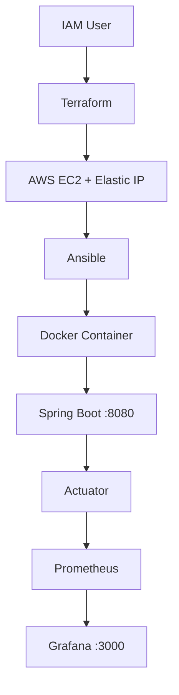

# ☁️ Cloud DevOps Dashboard

An end-to-end DevOps project that provisions AWS infrastructure with **Terraform**, configures it with **Ansible**, containerizes a **Spring Boot** application with **Docker**, deploys it via a **GitHub Actions CI/CD pipeline**, and monitors it using **Spring Boot Actuator, Prometheus, and Grafana**.

## 🏗️ Architecture

