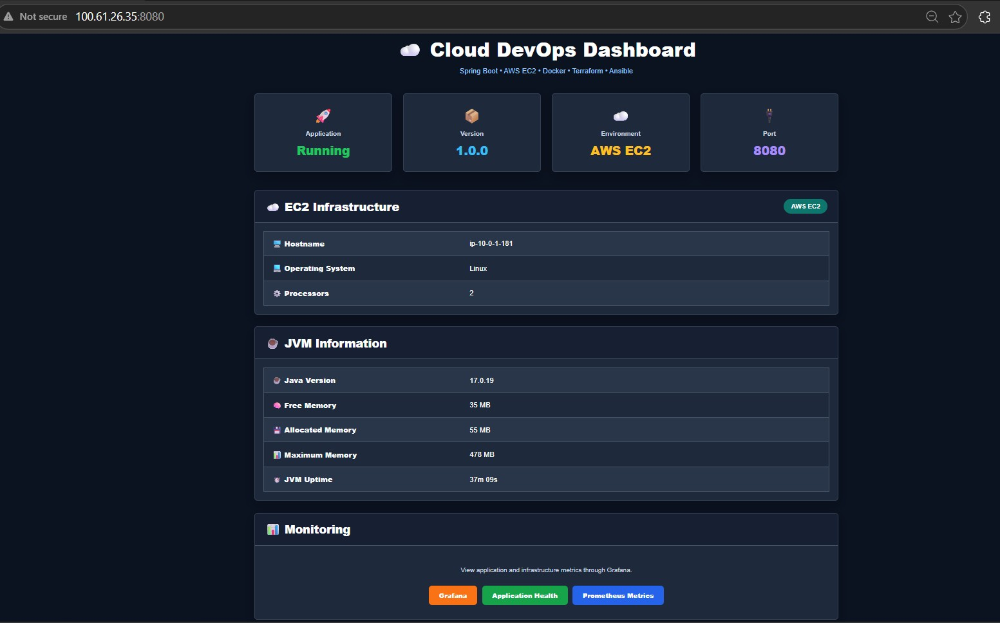
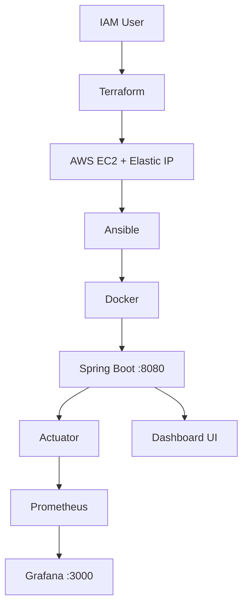
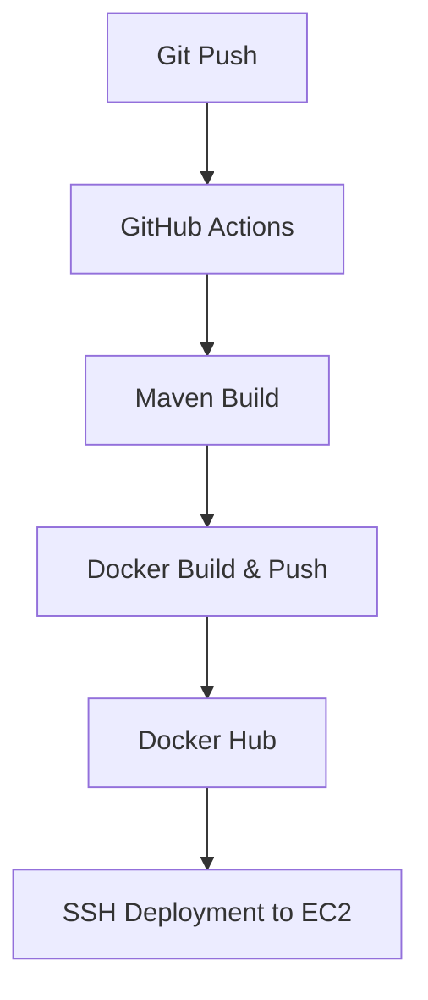
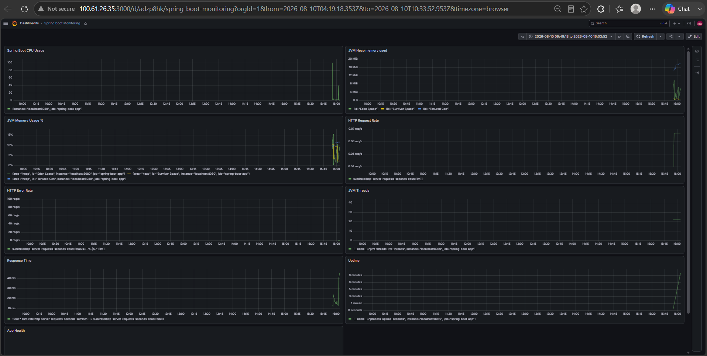

# ☁️ Cloud DevOps Dashboard

An end-to-end DevOps project that provisions AWS infrastructure with **Terraform**, configures it with **Ansible**, containerizes a **Spring Boot** application with **Docker**, deploys it via a **GitHub Actions CI/CD pipeline**, and monitors it using **Spring Boot Actuator, Prometheus, and Grafana**.



## 🏗️ Architecture



## 🔄 CI/CD



## 🛠️ Technology Stack

| Technology | Purpose |
|---|---|
| Java 17 | Application runtime |
| Spring Boot | Backend application |
| Thymeleaf | Server-side dashboard rendering |
| Maven | Build and dependency management |
| AWS IAM | Secure AWS authentication |
| AWS EC2 | Application hosting |
| Elastic IP | Stable public IP for EC2 |
| Terraform | Infrastructure provisioning |
| Ansible | Server configuration and automation |
| Docker | Containerization |
| Docker Hub | Docker image registry |
| GitHub Actions | CI/CD automation |
| Spring Boot Actuator | Health and application monitoring endpoints |
| Prometheus | Metrics collection |
| Grafana | Metrics visualization |

## ✨ Features

* **Infrastructure as Code** — AWS EC2 infrastructure is provisioned using Terraform instead of manually creating the server.
* **Automated Server Configuration** — Ansible is used to configure the EC2 environment and prepare it for application deployment.
* **Dockerized Application** — The Spring Boot application runs inside a Docker container for consistent deployments.
* **Automated CI/CD** — GitHub Actions builds the application, creates the Docker image, pushes it to Docker Hub, and deploys it to EC2.
* **Versioned Docker Images** — Docker images are tagged with the Git commit SHA, making each deployment traceable to a specific source-code version.
* **Stable EC2 Address** — An Elastic IP provides a consistent public address even when the EC2 instance is restarted.
* **Application Dashboard** — The custom dashboard displays application status, version, environment, port, EC2 information, and JVM statistics.
* **Application Monitoring** — Spring Boot Actuator exposes health and monitoring endpoints, with Prometheus metrics available for Grafana.
* **Grafana Visualization** — Grafana provides dashboards for monitoring application and JVM metrics.

 ## 🧩 Problem Solved: CI/CD Race Condition

Overlapping GitHub Actions runs could occasionally deploy a stale Docker image to EC2 when an older workflow reached the deployment step after a newer build.

Fixed with:

1. **Concurrency control** — `cancel-in-progress: true` cancels superseded workflow runs.
2. **SHA-based image tagging** — EC2 pulls the Docker image tagged with the exact Git commit SHA instead of relying only on `latest`.
 
## 📂 Project Structure

```text
cloud-devops-dashboard/
│
├── .github/
│   └── workflows/
│       └── deploy.yml                 # GitHub Actions CI/CD pipeline
│
├── ansible/
│   ├── ansible.cfg                    # Ansible configuration
│   └── deploy.yaml                    # EC2 server configuration/deployment
│
├── terraform/
│   ├── main.tf                        # EC2 infrastructure
│   ├── provider.tf                    # AWS provider configuration
│   ├── variables.tf                   # Terraform variables
│   ├── outputs.tf                     # Terraform outputs
│   ├── terraform.tfvars               # Infrastructure values
│   └── .terraform.lock.hcl            # Provider dependency lock
│
├── src/
│   ├── main/
│   │   ├── java/com/devops/dashboard/
│   │   │   ├── DashboardApplication.java
│   │   │   └── DashboardController.java
│   │   │
│   │   └── resources/
│   │       ├── templates/
│   │       │   └── dashboard.html      # Dashboard UI
│   │       └── application.properties # Application configuration
│   │
│   └── test/                           # Application tests
│
├── Dockerfile                          # Docker image configuration
├── pom.xml                             # Maven configuration
├── mvnw                                # Maven wrapper
├── mvnw.cmd                            # Maven wrapper for Windows
├── .dockerignore
├── .gitignore
└── README.md
```

## 🚀 Getting Started

# Option 1: Run Locally

```bash
git clone https://github.com/Anu0shree/cloud-devops-dashboard.git
cd cloud-devops-dashboard
mvn clean package
java -jar target/dashboard-0.0.1-SNAPSHOT.jar
```

Visit `http://localhost:8080`

# Option 2: Deploy on AWS

Note: The original AWS EC2 instance used for this project has been terminated to avoid ongoing AWS costs. The infrastructure is fully reproducible using Terraform, Ansible, and GitHub Actions.

1. Provision AWS infrastructure

```bash
cd terraform
terraform init
terraform apply
```
Terraform provisions the required AWS infrastructure, including the EC2 instance

2. Configure the EC2 instance with Ansible
```bash
cd ../ansible
ansible-playbook -i <EC2_PUBLIC_IP>, deploy.yaml
```

3. Deploy through GitHub Actions

Push changes to the main branch.

Prerequisites

Java 17, Maven, Docker, AWS account, AWS IAM credentials, Terraform CLI, Ansible, SSH access to the EC2 instance

## 📊 Monitoring

The application exposes monitoring endpoints using **Spring Boot Actuator**.

| Endpoint | Purpose |
|----------|---------|
| `/actuator/health` | Application health status |
| `/actuator/prometheus` | Prometheus-formatted application metrics |

Metrics collected by Prometheus are visualized through **Grafana**.

The dashboard UI also provides direct links to:

- Grafana
- Application Health
- Prometheus Metrics

Grafana provides visualization of the application and infrastructure metrics collected through Prometheus.

  

## 🧹 Teardown

To remove the AWS infrastructure and avoid ongoing AWS charges:
```bash
cd terraform
terraform destroy
```

## 👤 Author

Anushree Venkatraju

Built as an end-to-end DevOps and Cloud deployment project using AWS, Terraform, Ansible, Docker, GitHub Actions, Spring Boot, Prometheus, and Grafana.
