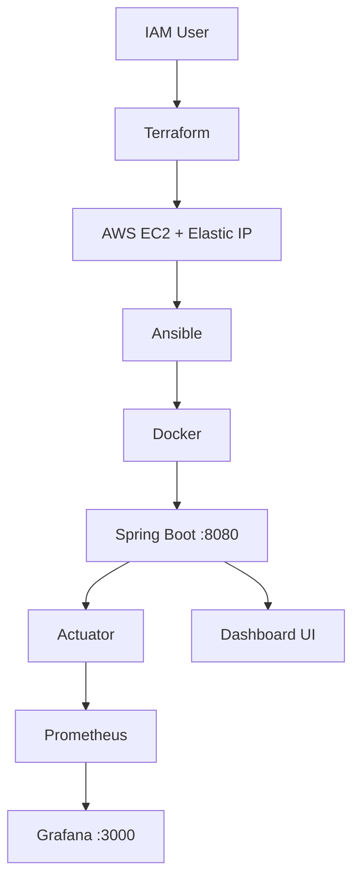
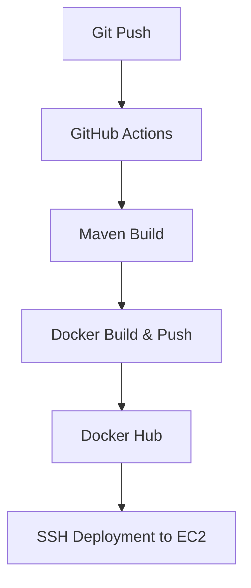

# ☁️ Cloud DevOps Dashboard

An end-to-end DevOps project that provisions AWS infrastructure with **Terraform**, configures it with **Ansible**, containerizes a **Spring Boot** application with **Docker**, deploys it via a **GitHub Actions CI/CD pipeline**, and monitors it using **Spring Boot Actuator, Prometheus, and Grafana**.

## 🏗️ Architecture

## 🔄 CI/CD

## 🛠️ Technology Stack

| Technology | Purpose |
|---|---|
| Java 17 | Application runtime |
| Spring Boot | Backend application |
| Thymeleaf | Server-side dashboard rendering |
| Maven | Build and dependency management |
| AWS IAM | Secure AWS authentication |
| AWS EC2 | Application hosting |
| Elastic IP | Stable public IP for EC2 |
| Terraform | Infrastructure provisioning |
| Ansible | Server configuration and automation |
| Docker | Containerization |
| Docker Hub | Docker image registry |
| GitHub Actions | CI/CD automation |
| Spring Boot Actuator | Health and application monitoring endpoints |
| Prometheus | Metrics collection |
| Grafana | Metrics visualization |
